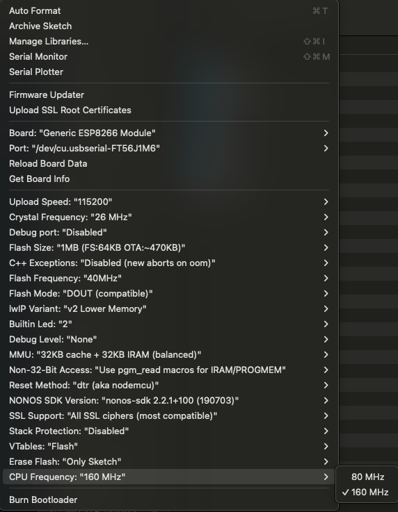
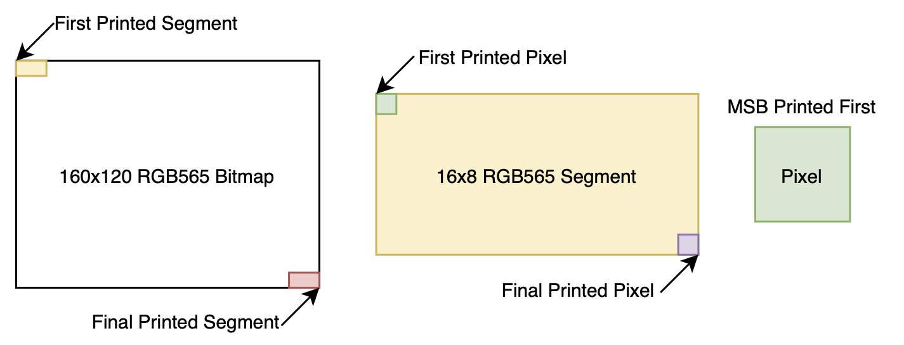
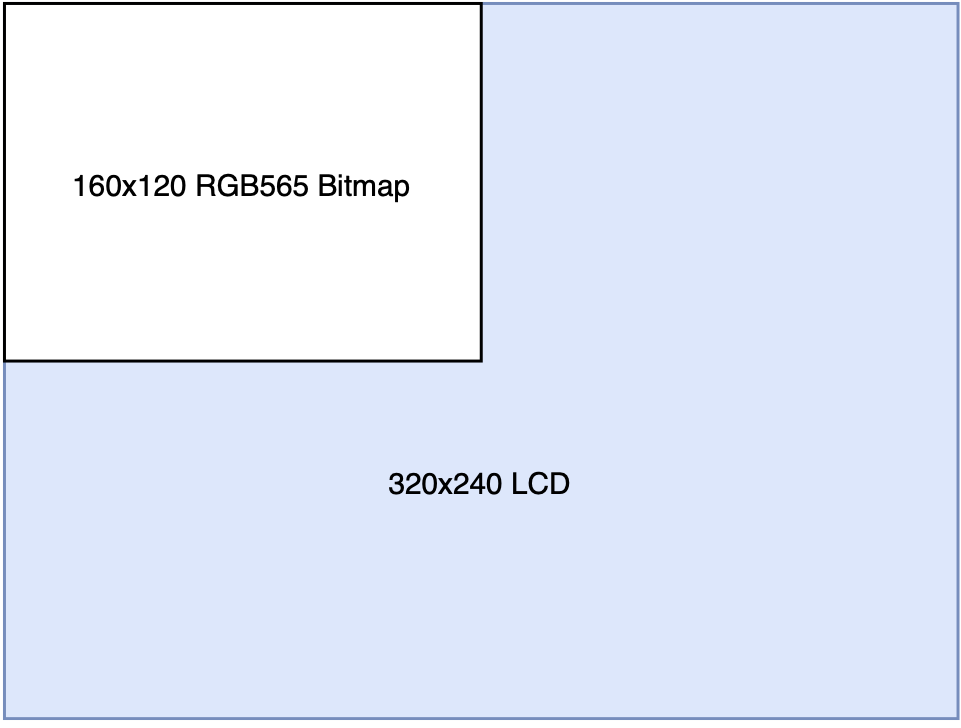

# ECEN-435-ESP

This repository is for ECEN-435 at the University of Nebraska-Lincoln (Scott Campus).
Included is the code for both the sender and receiver ESP8266 modules used in the semester project.

## Usage

Clone the repository.

```bash 
git clone https://github.com/paulscalise1/ECEN-435-ESP.git
```

Open both .ino files in 'sender' and 'receiver'.

Once in Arduino IDE, install the latest version of the ```TJpg_Decoder``` library using the library manager.

If you do not have the ESP8266 library installed, follow this [tutorial](https://randomnerdtutorials.com/how-to-install-esp8266-board-arduino-ide/).

In the board selector, choose "Generic ESP8266 Module".

Prior to flashing, set the CPU frequency to 160 MHz under "Tools" in the Arudino menu, seen below:



In [sender.ino](sender/sender.ino) you will need to enter the MAC address of your receiver ESP8266. You can obtain this by flashing receiver.ino to your receiver module, and note the MAC that is printed in the "Output" console during flashing.


## Code Architecture Breakdown

### Sender

The sender ESP on your camera board expects 3 different packet types: ```IMG```, ```GPS```, ```TOF```. These are all packet headers that the sender expects to receive over UART, prior to the actual data associated (image data, GPS coordinates, etc.)

Contained within the ```IMG``` packet is a JPEG with proper file start and end markers, specifically ```0xFFD8``` and ```0xFFD9``` respectively.
ArduCAM will automatically imbed these markers when JPEG is the chosen format. So, a valid image packet begins with 'IMG' followed by the full JPEG frame.
***JPEGs are expected to be of size 160x120.***

```GPS``` and ```TOF``` packets share similarities in their construction. Each ```GPS``` packet received by the sender must begin with 'GPS' and end with '\n'. ```TOF``` packets act the same, where they begin with 'TOF' and also end with '\n'.
In between the header and the final newline byte, is the payload. By default, there are no inherent restrictions on the size of this payload. By default, the GPS board will use a 16 byte payload containing coordinates. Both of the GPS and Proximity payloads are mutable, allowing flexibility in design for the user.

### Receiver

On the receiver side (the ESP8266 on your 8051 board), it expects the exact same packet structure as described above. You must note the MAC address of your receiver during programming, and place it within the sender code for proper transmission.
Once an ```IMG``` packet is received, the ESP8266 will decode the JPEG into a RGB565 payload.
The RGB565 payload will be printed out over UART to your 8051. ***Do not forget to properly match the baud rates!***

The payload of the 160x120 is structured as follows:
16x8 segments are printed to UART, in row-major order, beginning at the top left of the display, from left to right, top to bottom. The most significant byte of each 16 bit pixel value is printed first, followed by the least significant byte.
See the image below.



You then must upscale the image from 160x120 to 320x240 in order to fit the LCD on your 8051 board, as seen below.



### Development and Validation

There are some helpful files and scripts that I have so graciously provided in the 'validation' folder for debugging purposes. Check them out to validate output at different stages of development.

 